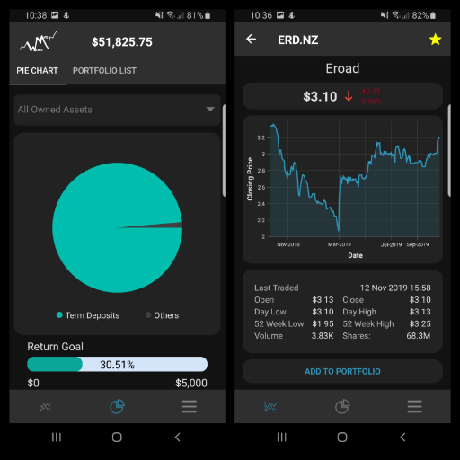

# WealthMate
WealthMate is an all in one mobile application that is designed to help users keep track of their own financial positions (keep track of the performance and details of each of their investments), make financial calculations/predictions, analyse the performance of stocks within the NZX, as well as look at the different ways they can invest their money (e.g. look at current term deposit rates, bond
options, cash savings rates, etc). WealthMate’s primary focus however is on users’ financial portfolios, where they will be able see live updates on their current financial positions (this is based on how their assets are performing).

  

